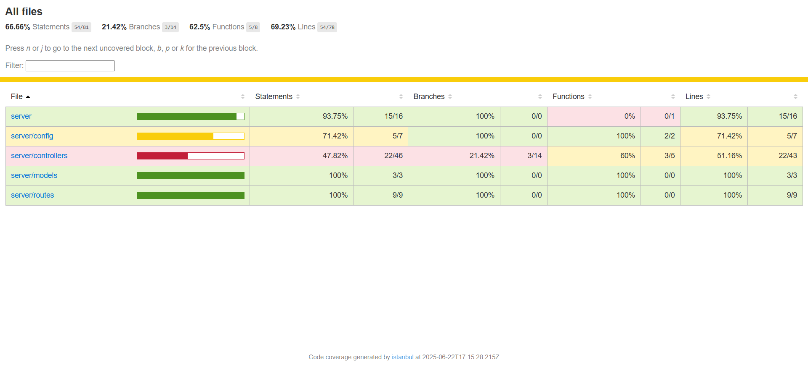
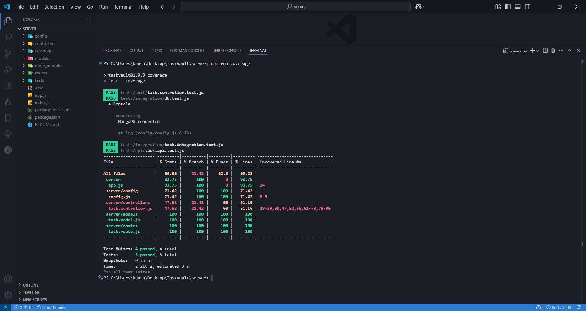

# ✅ Task Management API - Testing Suite

This project is a simple **Task Management API** built with **Node.js, Express, and MongoDB**, with complete **unit, integration, and API testing** using **Jest**, **Supertest**, and **mongodb-memory-server**.

---

## 📌 API Overview

| Method | Endpoint          | Description         |
|--------|-------------------|---------------------|
| GET    | /api/tasks        | Get all tasks       |
| GET    | /api/tasks/:id    | Get task by ID      |
| POST   | /api/tasks        | Create a new task   |
| PUT    | /api/tasks/:id    | Update a task       |
| DELETE | /api/tasks/:id    | Delete a task       |

---

## 🛠 Tech Stack

- **Backend**: Node.js, Express.js
- **Database**: MongoDB with Mongoose
- **Testing**: Jest, Supertest, mongodb-memory-server
- **Validation**: Joi
- **Security**: Rate Limiting
- **Others**: dotenv, CORS

---

## 🚀 Getting Started

### 1. Clone the Repository

```bash
git clone https://github.com/your-username/task-api-testing.git
cd task-api-testing
```

### 2. Install Dependencies

```bash
npm install
```

### 3. Environment Variables

Create a `.env` file in the root directory:

```
PORT=3000
MONGODB_URI=mongodb://localhost:27017/task-management
```

### 4. Run the App

```bash
# Development mode
npm run dev

# Production mode
npm start
```

### 5. Run Tests

```bash
# Run all tests
npm test

# Run with coverage report
npm run coverage
```

---

## 🧪 Test Types

- **Unit Tests**: Testing individual functions and components
- **Integration Tests**: Testing interactions between components
- **API Tests**: End-to-end testing of API endpoints

---

## 📷 Screenshots

### Test Coverage Results


*Screenshot showing test coverage results for the Task Management API*

### Terminal Output


*Screenshot showing test execution in the terminal*

---

## 🔄 CI/CD Pipeline

GitHub Actions is used to automatically test the app using Keploy:

📂 `.github/workflows/ci.yml`

[🔗 GitHub Repository](https://github.com/kaushik-2318/keploy-session-3)

---

## 📁 Project Structure

```
task-api-testing/
├── controllers/       # Route controllers
├── models/            # Database models
├── routes/            # API routes
├── tests/             # Test files
│   ├── unit/          # Unit tests
│   ├── integration/   # Integration tests
│   └── api/           # API tests
├── app.js             # Express app
├── index.js           # Entry point
└── package.json       # Dependencies
```

---

## 👨‍💻 Author

Kaushik Verma

---

## 📄 License

MIT